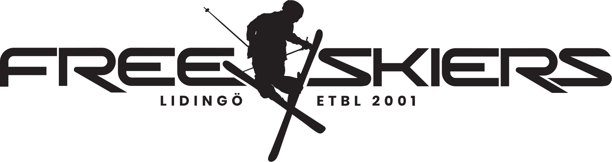

# IK Lidingö Freeskiers – Ny Webbsida

Officiellt repository för utvecklingen av IK Lidingö Freeskiers nya webbplats (byggd för React, Vite, Tailwind CSS och Lovable).

---

## 🏔️ Projektöversikt
IK Lidingö Freeskiers är Sveriges största friåkningsklubb för barn och unga med hemmabacke i Ekholmsnäsbacken på Lidingö. Denna nya webbplats ersätter den tidigare WordPress-sajten med en modern, blixtsnabb och mobiloptimerad webbupplevelse.

### Nyckelfunktioner:
* **Bokning & Anmälan:** Sömlös integration med **SportAdmin** för helgskidskola och skidklubb, samt **Agendo** för bokning av privatlektioner med tränarna.
* **Ekis the Yeti:** Smart FAQ-chattbot med klubbens maskot "Ekis".
* **Ekholmsnäsbacken Live:** Statusbanner med backens öppettider, snödjup, temperatur och webbkamera.
* **Eventyta & Nedräkning:** Framhävning av viktiga datum (anmälningsstart, Rookie Series, skidbytardag).
* **Nivåguide:** Interaktiv guide som hjälper föräldrar att välja rätt träningsgrupp.
* **Digitala Formulär:** Bli tränare (åk 9+), engagerade föräldrar, och klubbresor.

---

## 🎨 Design & Visuell Identitet
* **Typsnitt:** **Poppins** (Google Fonts)
* **Färger:**
  * Mörkblå (Rubriker & Footer): `RGB(59, 105, 161)` / `#3B69A1`
  * Ljusblå (Accenter & Footer-text): `RGB(72, 161, 213)` / `#48A1D5`
  * Snövit bas: `#FFFFFF` / `#F8FAFC`
  * Accentorange (CTA-knappar): `#FF6B35`
* **Logotyper:** Finns samlade i [`assets/logo/`](assets/logo/).

---

## 📄 Dokumentation
* **Färdig Kravspecifikation & PRD:** [`docs/website-spec.md`](docs/website-spec.md)
* **Lovable Master Prompt:** Se kapitel 5 i [`docs/website-spec.md`](docs/website-spec.md)
* **Workshop-underlag:** [`docs/workshop-plan.md`](docs/workshop-plan.md) och interaktiv dashboard i [`workshop/index.html`](workshop/index.html)